# Diffusion Play
A comprehensive repository for understanding and experimenting with diffusion model concepts

## Overview
This repository provides a hands-on tutorial and guide to fundamental concepts in diffusion models. Born from a weekend exploration of diffusion theory, it offers practical implementations that serve as an excellent starting point for anyone looking to dive into the world of diffusion models.

### Key Features
- **Basic Diffusion Model**: Train a simple diffusion model on MNIST data from scratch
- **Classifier Guidance**: Implement classifier-guided generation to produce class-specific samples
- **Knowledge Distillation**: Distill a 1000-step diffusion model into a single-step variant

All experiments have been tested locally on Mac hardware and basic AWS GPU instances. The code is designed to be accessible for various hardware configurations, though H100/A100 GPUs will significantly accelerate training.

## Quick Start

### Requirements
Install dependencies with:
```bash
pip install -r requirements.txt
```

### Basic Usage

#### 1. Basic Diffusion Model

```bash
python src.py
```

Once tyrained you will see a checkpoint "diffusion_model_final.pt" that will get saved. 

#### 2. Classifier Guidance 

```bash
python src_cfg.py
```

#### 3. DDIM Sampling

```bash
python sample_ddim.py
```

This script will load the trained diffusion model checkpoint but will run DDIM sampling method on top of it. 

#### 4. Distillation 

```bash
python train_distilled.py
```

Note: Distillation is very slow, and it took me a few days to get this up and running to see anything meaningful. Suggestions are more than welcome here! 


## Detailed Guide

### 1. Basic Diffusion Model
The foundation of this repository is a straightforward diffusion model implementation. Follow the inline comments to understand each step of the process.

**Recommended Prerequisites**: If you're new to diffusion models, we highly recommend completing the [How Diffusion Models Work](https://www.deeplearning.ai/short-courses/how-diffusion-models-work/) course by DeepLearning.AI.

**Results**:
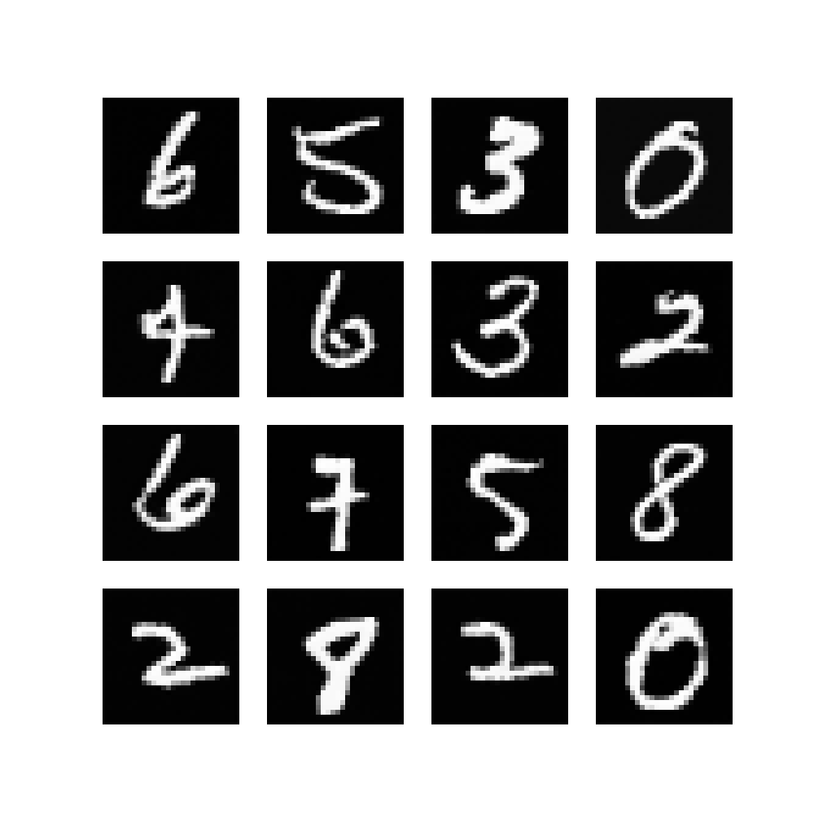

**Pre-trained Checkpoint**: [Download from Google Drive](https://drive.google.com/file/d/1Md2c9AKDnFSX-5fOtwmy_H7JJex2Y4re/view?usp=sharing)

### 2. Classifier Guidance
Classifier guidance enhances diffusion models by incorporating class-conditional information during generation.

**Core Concept**: After each noise prediction, a classifier evaluates how to modify the image to better match a target class. The final denoising step combines the diffusion model's learned distribution with a bias toward the desired class.

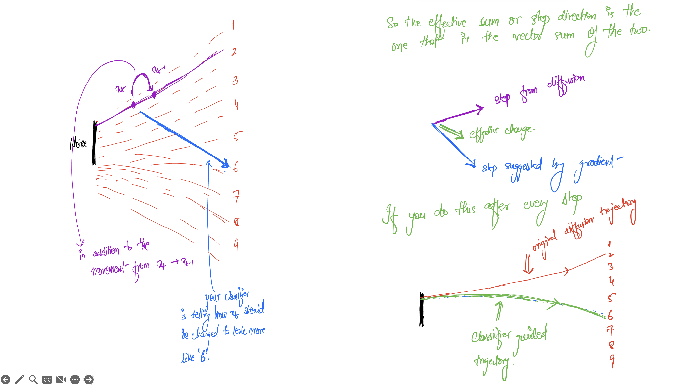

#### Results Comparison

**Guidance Scale 3.0**:
- Class 0: 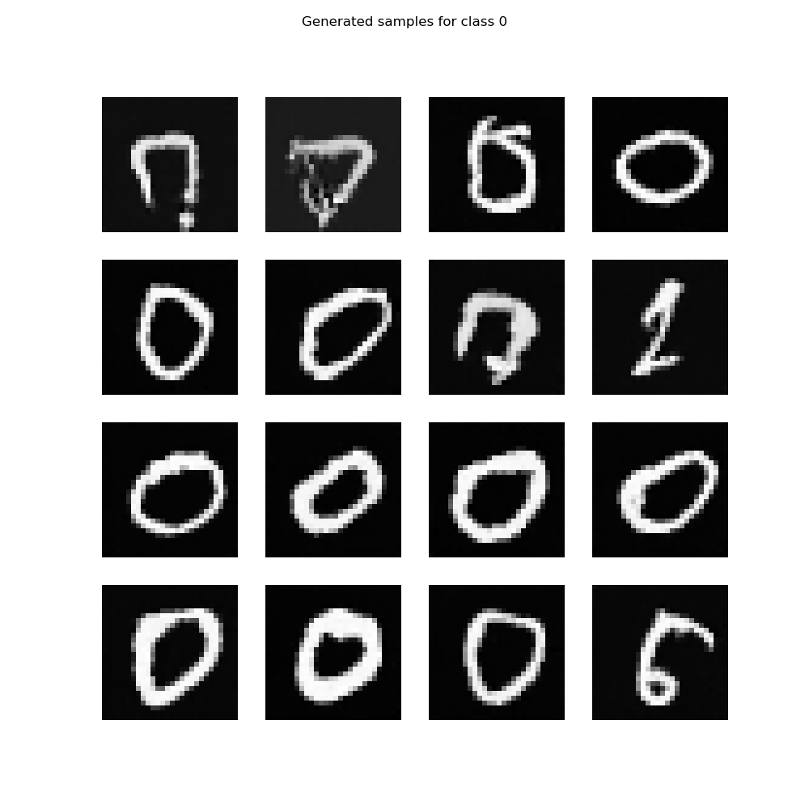
- Class 4: 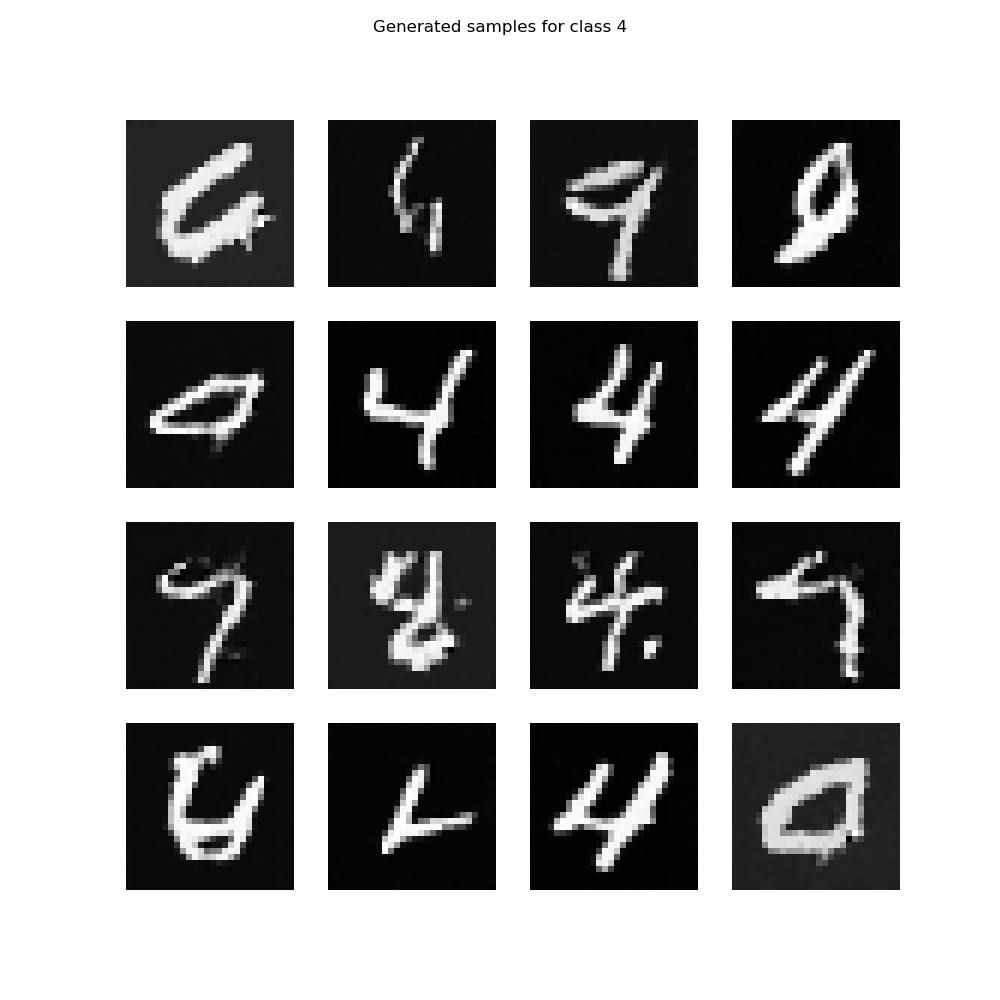
- Class 9: 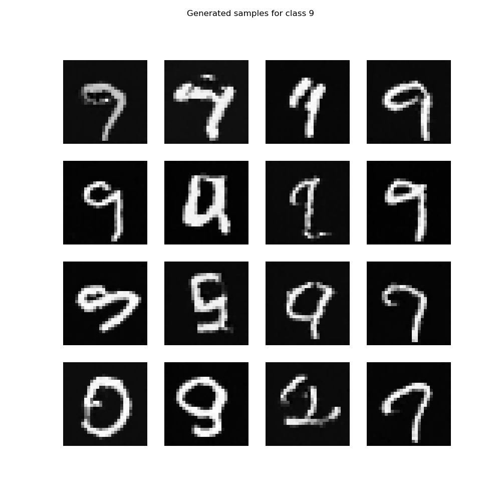

**Guidance Scale 8.0**:
- Class 0: 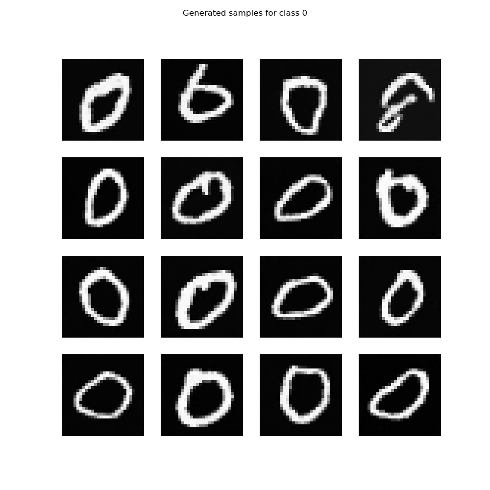
- Class 4: 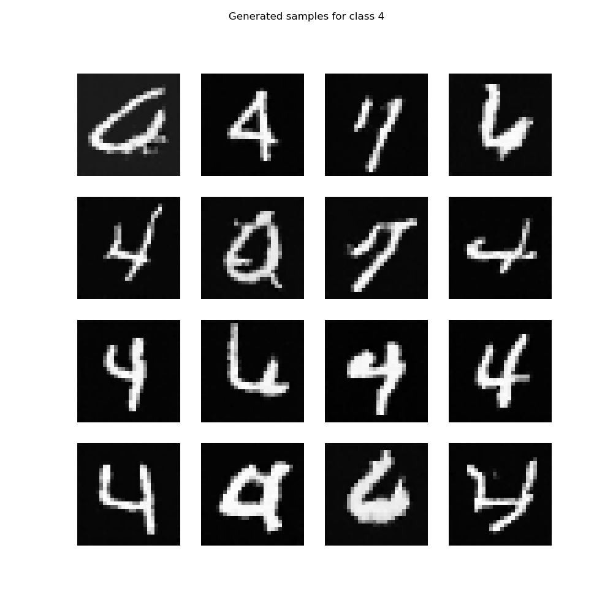
- Class 9: 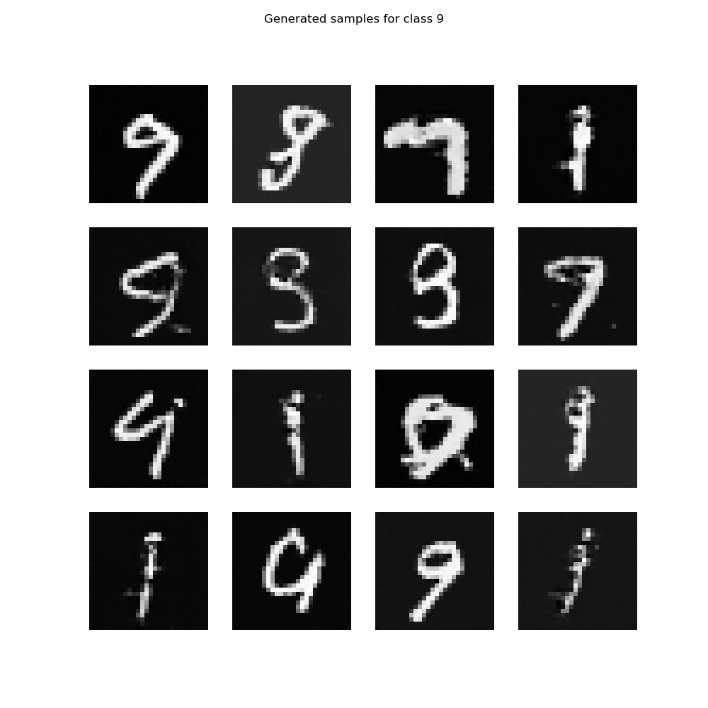

**Observation**: Higher guidance scales (8.0) produce stronger class conditioning but may occasionally lead to over-optimization artifacts.

### 3. DDIM Sampling

**DDIM Sample 20 steps**:

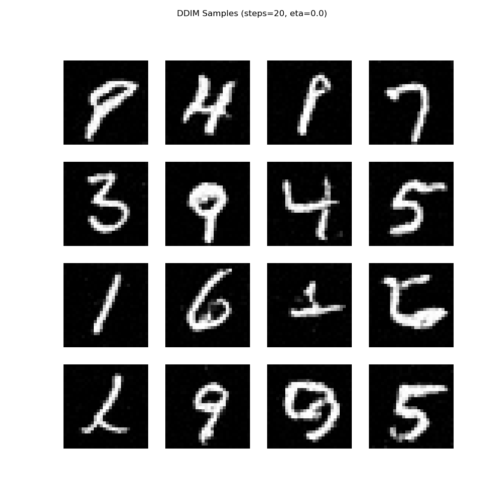

**DDIM Sample 50 steps**:

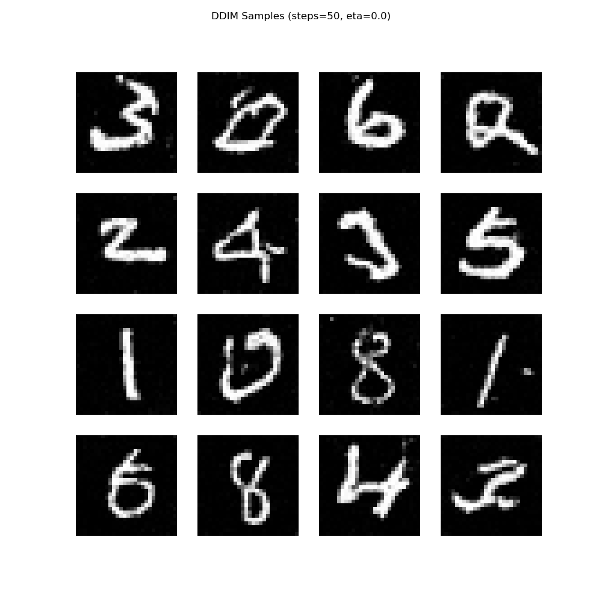

**DDIM Sample 100 steps**:


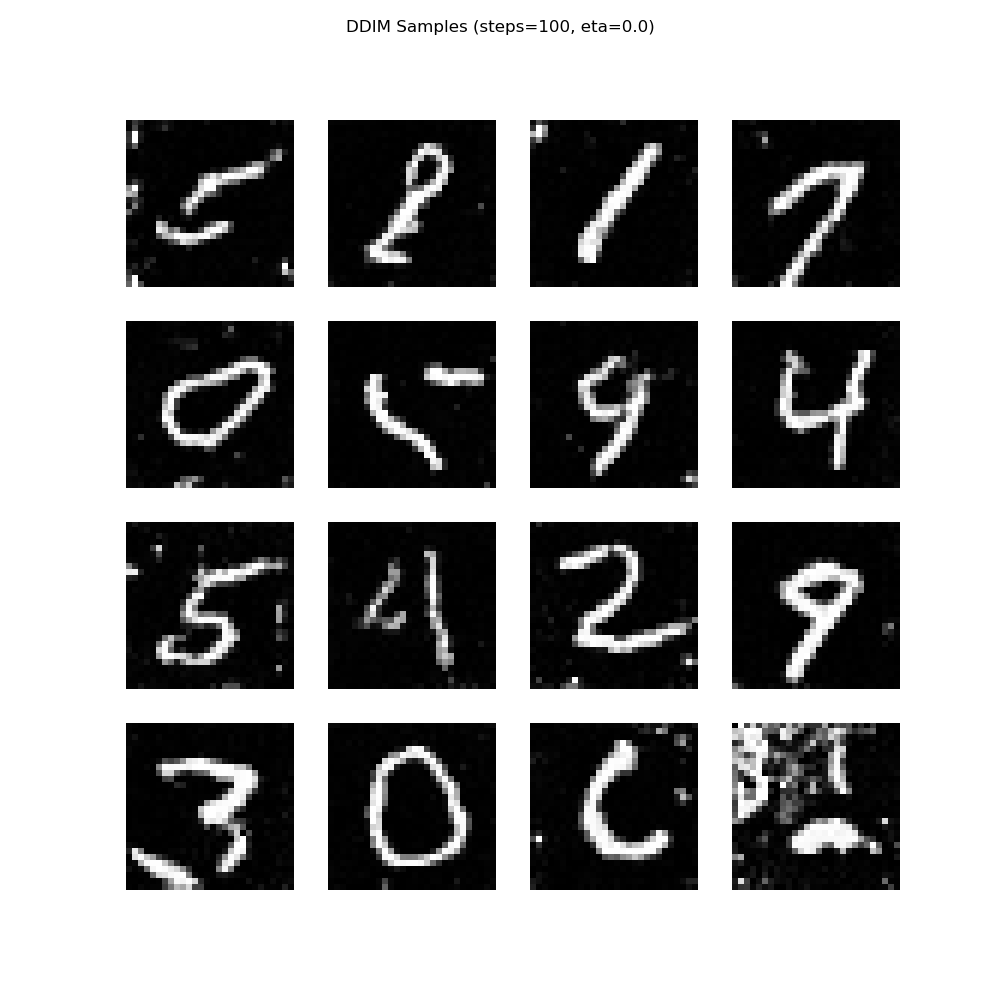


### 4. Knowledge Distillation
Transform a multi-step diffusion process into a single-step model while preserving generation quality. I wasn't able to get something impressive here, I am still trying but this is the checkpoint that i have after 35 epochs. [checkpoint](https://drive.google.com/file/d/18xN60F-bS0_rxatPkevdq91kjWNVMut9/view?usp=sharing)

## Contributing
Encountered an issue or have suggestions? Please create an issue or reach out directly. Contributions and feedback are welcome!

## Future Work
- [ ] Add theoretical background notes
- [ ] Extend classifier guidance experiments to ImageNet
- [ ] Implement classifier-free guidance
- [ ] Add more distillation techniques
- [ ] Performance benchmarking across different hardware

## Acknowledgments
Special thanks to the DeepLearning.AI team for their excellent diffusion models course, which inspired parts of this implementation.

---
*Note: This repository prioritizes educational value and experimentation over production-ready code. Some repetition exists across modules to maintain clarity and independence of examples.*